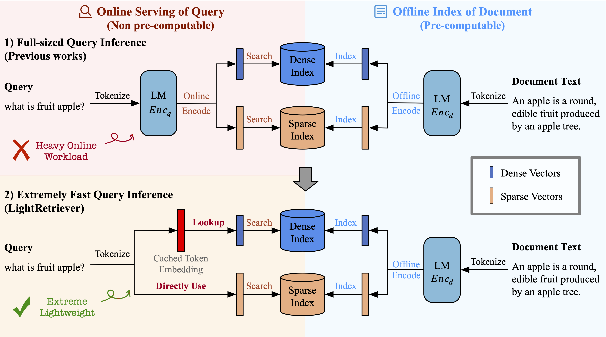

# LightRetriever
Repository for Research Paper [LightRetriever: A LLM-based Text Retrieval Architecture with Extremely Faster Query Inference](https://arxiv.org/abs/2505.12260). 

<div align="center">
  
  <p>LightRetriever targets at extreme query inference speed for LLM-based text retrieval, reducing the workload of query encoding to no more than an embedding lookup.</p>
</div>

## Environment Setup

### Evaluation Environment
Please set up the following packages for evaluation:

1. Install [Faiss](https://github.com/facebookresearch/faiss/blob/main/INSTALL.md) by following their guidelines for dense evaluation support.
2. Download [Anserini jar](https://repo1.maven.org/maven2/io/anserini/anserini/0.25.0/anserini-0.25.0-fatjar.jar) to the project folder for sparse evaluation support.

```bash
wget https://repo1.maven.org/maven2/io/anserini/anserini/0.25.0/anserini-0.25.0-fatjar.jar
```

3. JAVA environment setup. Please install openjdk-17-jdk:

```bash
sudo apt-get update
sudo apt-get install openjdk-17-jdk
```

### Training Environment
You can easily set up the environment by cloning this repo, and runing the following command.

```bash
pip install -e .
```

## Model & Data Releases
Multiple fine-tuned retriever LoRA weights are released.

| Model               | Description                                     |
|---------------------|-------------------------------------------------|
| [lightretriever/lightretriever-llama3.1-8b-mrl](https://huggingface.co/lightretriever/lightretriever-llama3.1-8b-mrl)  | Fine-tuned [Llama3.1-8b](https://huggingface.co/meta-llama/Llama-3.1-8B) retriever with [MRL](https://arxiv.org/abs/2205.13147), supporting flexible Top-k dimension/sparsity controls.  |
| [lightretriever/lightretriever-llama3.1-8b](https://huggingface.co/lightretriever/lightretriever-llama3.1-8b)  | Fine-tuned [Llama3.1-8b](https://huggingface.co/meta-llama/Llama-3.1-8B) retriever, supporting symmetric dense, asymmetric dense & sparse retrieval.  |
| [lightretriever/lightretriever-llama3.2-3b](https://huggingface.co/lightretriever/lightretriever-llama3.2-3b)  | Fine-tuned [Llama3.2-3b](https://huggingface.co/meta-llama/Llama-3.2-3B) retriever, supporting symmetric dense, asymmetric dense & sparse retrieval.  |
| [lightretriever/lightretriever-llama3.2-1b](https://huggingface.co/lightretriever/lightretriever-llama3.2-1b)  | Fine-tuned [Llama3.2-1b](https://huggingface.co/meta-llama/Llama-3.2-1B) retriever, supporting symmetric dense, asymmetric dense & sparse retrieval.  |
| [lightretriever/lightretriever-qwen2.5-7b](https://huggingface.co/lightretriever/lightretriever-qwen2.5-7b)  | Fine-tuned [Qwen2.5-7B](https://huggingface.co/Qwen/Qwen2.5-7B) retriever, supporting symmetric dense, asymmetric dense & sparse retrieval.  |
| [lightretriever/lightretriever-qwen2.5-3b](https://huggingface.co/lightretriever/lightretriever-qwen2.5-3b)  | Fine-tuned [Qwen2.5-3B](https://huggingface.co/Qwen/Qwen2.5-3B) retriever, supporting symmetric dense, asymmetric dense & sparse retrieval.  |
| [lightretriever/lightretriever-qwen2.5-1.5b](https://huggingface.co/lightretriever/lightretriever-qwen2.5-1.5b)  | Fine-tuned [Qwen2.5-1.5B](https://huggingface.co/Qwen/Qwen2.5-1.5B) retriever, supporting symmetric dense, asymmetric dense & sparse retrieval.  |

We follow the data preparation processes of [tDRO](https://github.com/ma787639046/tdro?tab=readme-ov-file#data-preparation). All training sets with proper **Hard Negative Mining** and **Deduplication** (with test sets) are relasesd as follows.

| Dataset             | Description                                     |
|---------------------|-------------------------------------------------|
| [lightretriever/lightretriever-finetune-data](https://huggingface.co/datasets/lightretriever/lightretriever-finetune-data)  | All training sets. |


## Get Started
The scripts below shows inference examples.  

### EmbeddingBag Caching
**Script**: [cache_emb_bag.ipynb](scripts/cache_emb_bag.ipynb)

LightRetriever asymmetric dense retrieval needs to cache an EmbeddingBag before serving. Please refer to the above reference script. 

### Asymmetric Dense Embedding Inferencing
**Script**: [scripts/asymmetric_dense_infer.ipynb](scripts/asymmetric_dense_infer.ipynb)

An example to show how to load and encode with LightRetriever's dense query EmbeddingBag & document LLM encoder.

### Asymmetric Sparse Embedding Inferencing
**Script**: [scripts/asymmetric_sparse_infer.ipynb](scripts/asymmetric_sparse_infer.ipynb)

An example to show how to encode with LightRetriever's sparse query token counts & document LLM encoder.


## Training 
**Script**: [`scripts/finetune_example.sh`](scripts/finetune_example.sh)

A full fine-tuned script to reproduce [lightretriever/lightretriever-llama3.1-8b](https://huggingface.co/lightretriever/lightretriever-llama3.1-8b) is released. All retriever fine-tuning with different LLM backbones shares the same training hyper-parameters as defined in this script.

### 1. Training Set Download
Please clone all necessary [training sets](https://huggingface.co/lightretriever/lightretriever-qwen2.5-1.5b) to a local folder, e.g. `data/train`. Then set the correct path to preprocessed dictionary, such as `--preprocessed_dir data/train`. All needed training sets and the corresponding sampling weights are defined in [`config/data/exp-m.json`](config/data/exp-m.json).

### 2. Fine-tuning
Please refer to the reference script [`scripts/finetune_example.sh`](scripts/finetune_example.sh) to finetune LightRetriver. 


## Evaluation
Please refer to [`eval/README.md`](eval/README.md) for more details.


## Bugs or Questions
If you encounter any bugs or questions, please feel free to email me or open an issue.

**Contacts**: Guangyuan Ma (maguangyuan@iie.ac.cn)


## Cite
If you are interested in our work, please consider citing our paper.

```bibtex
@article{@article{DBLP:journals/corr/abs-2505-12260,
  author       = {Guangyuan Ma and
                  Yongliang Ma and
                  Xuanrui Gou and
                  Zhenpeng Su and
                  Ming Zhou and
                  Songlin Hu},
  title        = {LightRetriever: {A} LLM-based Text Retrieval Architecture with Extremely
                  Faster Query Inference},
  journal      = {CoRR},
  volume       = {abs/2505.12260},
  year         = {2025},
  url          = {https://doi.org/10.48550/arXiv.2505.12260},
  doi          = {10.48550/ARXIV.2505.12260},
  eprinttype    = {arXiv},
  eprint       = {2505.12260},
  timestamp    = {Mon, 23 Jun 2025 13:59:12 +0200},
  biburl       = {https://dblp.org/rec/journals/corr/abs-2505-12260.bib},
  bibsource    = {dblp computer science bibliography, https://dblp.org}
}
}
```

